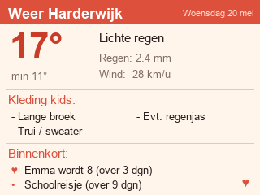
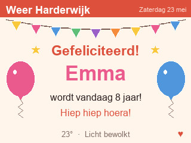

# Lovebox Dagbericht

Stuurt elke ochtend een afbeelding (320×240) naar je [Lovebox](https://en.lovebox.love/)
met:

- de **weersverwachting** + **kledingadvies** voor de kinderen, en
- de eerstvolgende **verjaardagen** en **activiteiten**.

De container draait continu en verstuurt zelf dagelijks — geen losse cron nodig.

Deze repo is bewust **publiek-veilig**: alle persoonsgegevens (login, box-id,
namen en datums, locatie) komen uit omgevingsvariabelen. Er staat niets
gevoeligs in git.

---

## Voorbeeld

| Dagelijkse weergave | Feestmodus op de verjaardag |
|---|---|
|  |  |

<sub>Schermafbeeldingen met fictieve namen/datums (320×240).</sub>

## Hoe werkt het?

| Onderdeel | Bron |
|-----------|------|
| Weer | [Open-Meteo](https://open-meteo.com) — gratis, geen API-key |
| Kledingadvies | Afgeleid van max-temp, neerslag en wind (zie tabel onderaan) |
| Verjaardagen/activiteiten | JSON in env-vars |
| Versturen | Lovebox GraphQL-API (`sendPixNote`) |

### Wat wordt er getoond aan datums?

- **Verjaardagen** verschijnen pas als ze **binnen 30 dagen** vallen
  (`LOVEBOX_BIRTHDAY_WINDOW_DAYS`).
- **Activiteiten** verschijnen binnen een **instelbaar venster**
  (`LOVEBOX_EVENT_WINDOW_DAYS`, standaard 30 dagen).
- Er worden **maximaal 2 datums tegelijk** getoond (`LOVEBOX_MAX_SLOTS`),
  waarbij **verjaardagen voorrang** krijgen op activiteiten.
- **Op de verjaardag zelf** verschijnt een feestelijke weergave: een grote
  "Gefeliciteerd {naam}!" met ballonnen, confetti en sterren (in plaats van
  het kledingadvies). Vallen er twee verjaardagen op dezelfde dag, dan worden
  beide namen getoond.

---

## Configuratie

Kopieer `.env.example` naar `.env` en vul in. `.env` staat in `.gitignore` —
**commit hem nooit**.

```bash
cp .env.example .env
```

### Verplicht

| Variabele | Omschrijving |
|-----------|--------------|
| `LOVEBOX_EMAIL` | Je Lovebox-account e-mail |
| `LOVEBOX_PASSWORD` | Je Lovebox-wachtwoord |
| `LOVEBOX_BOX_ID` | Het id van de doelbox (zie hieronder) |

### Optioneel

| Variabele | Default | Omschrijving |
|-----------|---------|--------------|
| `LOVEBOX_LAT` / `LOVEBOX_LON` | `52.3415` / `5.6147` | Coördinaten voor het weer |
| `LOVEBOX_LOCATION_NAME` | `Harderwijk` | Naam in de header |
| `LOVEBOX_BIRTHDAYS` | – | JSON-lijst met verjaardagen |
| `LOVEBOX_EVENTS` | – | JSON-lijst met activiteiten |
| `LOVEBOX_BIRTHDAY_WINDOW_DAYS` | `30` | Venster voor verjaardagen |
| `LOVEBOX_EVENT_WINDOW_DAYS` | `30` | Venster voor activiteiten |
| `LOVEBOX_MAX_SLOTS` | `2` | Max. aantal datums op de afbeelding |
| `LOVEBOX_RUN_AT` | `07:00` | Tijdstip van dagelijks versturen |
| `LOVEBOX_TZ` | `Europe/Amsterdam` | Tijdzone van de scheduler |
| `LOVEBOX_RUN_ON_START` | `false` | Meteen versturen bij (her)start |
| `LOVEBOX_RUN_ONCE` | `false` | Eén keer versturen en stoppen |

### Formaat van verjaardagen/activiteiten

Beide zijn een JSON-lijst van `{"name": ..., "date": ...}`:

```json
LOVEBOX_BIRTHDAYS=[{"name":"Emma","date":"2018-03-15"},{"name":"Sem","date":"07-01"}]
LOVEBOX_EVENTS=[{"name":"Schoolreisje","date":"2026-07-10"},{"name":"Sinterklaas","date":"12-05"}]
```

- `"date": "YYYY-MM-DD"` → **met jaar**. Bij een verjaardag wordt de leeftijd
  getoond ("Emma wordt 8"); bij een activiteit is het **eenmalig** (verdwijnt
  na de datum).
- `"date": "MM-DD"` → **jaarlijks terugkerend** (verjaardag zonder leeftijd,
  of een terugkerende activiteit zoals Sinterklaas).

> **Privacy:** dit zijn persoonsgegevens (namen/datums, deels van kinderen).
> Houd ze in `.env` / de container-omgeving; zet ze nooit in de publieke repo.

---

## Box-ID ophalen (eenmalig)

```bash
curl -s -X POST https://app-api.loveboxlove.com/v1/auth/loginWithPassword \
  -H "content-type: application/json" \
  -d '{"email":"jouw@email.nl","password":"jouwWachtwoord"}'
```

Pak de `token` uit het antwoord, dan:

```bash
TOKEN="..."
curl -s -X POST https://app-api.loveboxlove.com/v1/graphql \
  -H "authorization: Bearer $TOKEN" \
  -H "content-type: application/json" \
  -d '{"operationName":"me","variables":{},"query":"query me { me { boxes { _id nickname } } }"}'
```

Kopieer de `_id` van de gewenste box naar `LOVEBOX_BOX_ID`.

---

## Lokaal draaien / testen

```bash
python -m venv .venv && source .venv/bin/activate
pip install -e ".[dev]"

# Eén keer versturen (schrijft ook een preview-PNG):
LOVEBOX_RUN_ONCE=true python -m lovebox.main

# Tests + lint:
pytest
ruff check .
ruff format --check .
```

Bij `LOVEBOX_RUN_ONCE=true` wordt de afbeelding vóór verzenden opgeslagen als
`lovebox_preview.png` (in `/data` als dat bestaat, anders `/tmp`).

---

## Deployen op TrueNAS (custom app)

De container is **self-scheduling**: hij blijft draaien en verstuurt dagelijks
rond `LOVEBOX_RUN_AT`. Geen webserver → geen ports of reverse-proxy nodig. Zo
staat hij netjes in je apps-lijst.

**1. Zorg dat de ghcr-package public is** (of geef TrueNAS een pull-credential),
anders kan `pull_policy: always` het image niet ophalen.

**2. Zet je `.env` op een vast pad**, bijv. `/mnt/apps/lovebox/.env`, met de
credentials + agenda-JSON (zie [Configuratie](#configuratie)). Zorg dat
`LOVEBOX_RUN_ONCE=false` en dat het pad exact klopt.

**3. Apps → Discover Apps → ⋮ → Install via YAML**, naam `lovebox`, en plak:

```yaml
services:
  lovebox:
    image: ghcr.io/arjankapteijn/lovebox:latest
    container_name: lovebox
    pull_policy: always
    restart: unless-stopped
    env_file: /mnt/apps/lovebox/.env   # absoluut pad! relatief .env wordt /tmp/.env
    read_only: true
    tmpfs:
      - /tmp:size=8m
    volumes:
      - lovebox-data:/data             # named volume: erft app:app uit het image
    cap_drop:
      - ALL
    security_opt:
      - no-new-privileges:true
    mem_limit: 256m
    pids_limit: 128

volumes:
  lovebox-data:
```

**4. Start.** Optioneel eerst `LOVEBOX_RUN_ON_START=true` in de `.env` om de
deploy meteen te testen (daarna weer op `false`, anders stuurt elke herstart
een bericht). **Zet je oude cron-job uit** zodra de container draait.

De container draait als non-root, met read-only rootfs, `cap_drop: ALL`,
`no-new-privileges` en een healthcheck op een heartbeat-bestand in `/data`.

> **Twee valkuilen (uit ervaring):**
> - Gebruik een **absoluut** `env_file`-pad. Een relatief `.env` wordt door
>   TrueNAS naar `/tmp/.env` herleid en niet gevonden.
> - Gebruik een **named volume** voor `/data`, geen `tmpfs`. Een tmpfs is niet
>   schrijfbaar voor de non-root app-user, waardoor het heartbeat-bestand niet
>   geschreven wordt, de healthcheck faalt en de app op *"deploying"* blijft
>   hangen.

### Een eigen icoon in de Apps-lijst

TrueNAS custom apps hebben geen icoon-veld in de YAML; de zichtbaarheid komt uit
de app-metadata. Voeg in `/mnt/.ix-apps/metadata.yaml` onder het `lovebox`-blok
een `icon`-regel toe (onder `metadata:`), bijv. naar het icoon in deze repo:

```yaml
    "icon": "https://raw.githubusercontent.com/arjankapteijn/lovebox/main/docs/icon.png"
```

> Let op: TrueNAS kan dit bestand bij een app-update overschrijven, dus
> controleer het icoon na een update.

### Updaten

`:latest` + `pull_policy: always`: app opnieuw deployen → nieuwste image. Voor
reproduceerbaarheid kun je een vaste tag pinnen (bijv.
`ghcr.io/arjankapteijn/lovebox:0.3.2`) en die bumpen.

---

## CI/CD & versiebeheer

Zelfde opzet als arjankapteijn.nl:

- **`.github/workflows/ci.yml`** — bij elke push/PR: `ruff` + `pytest`.
- **`.github/workflows/docker-publish.yml`** — bij push naar `main` wordt
  automatisch de volgende **semver** afgeleid uit de commit-messages
  ([conventional commits](https://www.conventionalcommits.org/): `feat` → minor,
  `!`/`BREAKING CHANGE` → major, anders patch), een **git-tag** + **GitHub
  Release** aangemaakt, en het **image naar ghcr.io** gepusht.
- **`.github/dependabot.yml`** — wekelijkse update-PR's voor pip, het
  Docker-base-image en de GitHub Actions.

> Na de eerste push: zet **Dependabot alerts + security updates** aan via
> GitHub → *Settings → Code security and analysis*, en zet de ghcr.io-package
> op **public**.

---

## Kledingadvies-logica

| Max temperatuur | Broek | Bovenkleding |
|-----------------|-------|--------------|
| ≥ 24 °C | Korte broek | Korte mouwen |
| 22–24 °C | Korte broek | T-shirt + vest |
| 18–22 °C | Lange broek | T-shirt + vest |
| 12–18 °C | Lange broek | Trui / sweater |
| < 12 °C | Warme broek | Warme jas |

Extra: regenjas mee bij ≥ 3 mm, eventueel regenjas bij 0,5–3 mm, windproof jas
bij ≥ 50 km/u.

---

## Bronnen

- Open-Meteo API (gratis, geen key): <https://open-meteo.com>
- Lovebox GraphQL reverse-engineering:
  <https://swizec.com/blog/reverse-engineer-a-graphql-api-to-automate-love-notes-codewithswiz-24/>
- `patbaumgartner/lovebox-telegram-sender` (config-naming, me-query)
- npm `lovebox-client` (bevestiging `senderDeviceId = me.device._id`)
